# Terraform + tfsec + Jenkins 배포 자동화 

- Terraform 은 Hashicorp 에서 개발하고, 오픈소스화한 프로비져닝 툴이다. 
- 다양한 Cloud Provider 리소스 프로비저닝을 제공하며, OnPreme에서도 프로비져닝을 활용할 수 있는 다양한 방법을 제공하고 있다. 
- 프로비저닝의 경우 잠재적인 보안 이슈를 가지고 있으며 이를 검사하고, 보안상 안정적이지 않은 경우 배포를 중지할 필요가 있다. 
- 이때 사용할 수 있는 것이 tfsec라는 도구이다. 
- 여기서는 tfsec으로 테라폼 코드를 확인하고, terraform으로 프로비져닝 단계를 Jenkins Pipeline으로 구성할 것이다. 

## Jenkins 설치하기 

- Jenkins 의 경우 Docker를 이용하여 설치할 것이다. 

### 사전 준비사항 

- 우선 Docker가 호스트에 설치가 되어 있어야한다. 
- Jenkins 컨테이너에서 Docker가 수행되어야 하기 때문에 host의 Docker를 이용하도록 볼륨 마운트가 필요하다. 

- 필요한 볼륨은 다음과 같이 연결된다. 
  - host: /var/run/docker.sock
  - Jenkins Contianer: /var/run/docker.sock

### Jenkins 컨테이너 실행하기

- 이제 Jenkins를 띄워보자. 
  
```py
sudo docker run -d --name myjenkins \
  -v `pwd`/data:/var/jenkins_home \
  -v /var/run/docker.sock:/var/run/docker.sock \
  -p 8080:8080 -p 50000:50000 \
  jenkins/jenkins
```

- sudo docker run: docker 컨테이너를 실행한다. 이때 sudo 로 어드민 권한으로 실행한다. 
- '-d': 백그라운드로 컨테이너를 실행한다. 
- '--name myjenkins': 컨테이너 인스턴스 이름을 지정한다. 
- '-v `pwd`/data:/var/jenkins_home': 현재 실행하는 host의 위치에 data 디렉토리와 Jenkins 내부에 /var/jenkins_home 볼륨을 연결한다. 
- '-v /var/run/docker.sock:/var/run/docker.sock': docker.sock 을 컨테이너에서 host의 파일을 이용할 수 있도록 볼륨 마운트를 한다. 
- '-p 8080:8080 -p 50000:50000': jenkins 포트를 연결한다. 8080으로 화면에 접근한다. 50000은 내부에서 사용한다. 
- 'jenkins/jenkins': 최신 jenkins 컨테이너 이미지를 지정한다. 

### Jenkins 내부에 docker 실행하기. 

- 아래 명령어로 컨테이너 내부에 root 게정으로 접근한다. 

```go
docker exec -it --user root <container_id> /bin/bash
```

- 아래 명령어로 docker를 설치한다. 

```go
$ curl -fsSL https://get.docker.com | sh
```

- '-fsSL' 을 이용하면 curl을 이용하여 바이너리 파일을 다운로드 할 수 있다. 
- 'sh' 명령을 파이프하여 다운받은 설치 파일을 바로 설치한다. 

```go
$ docker ps
```

- 위 결과가 정상으로 수행되면 다음 단계로 넘어갈 준비가 된 것이다. 

## Jenkins Console 구성하기. 

- 이제 Jenkins Console에 접근하여 초기화를 마무리하자. 

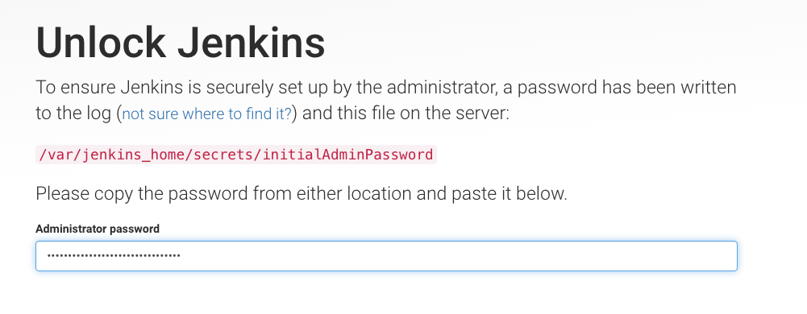

- 위와 같이 암호를 입력하기 위해서는 다음 커맨드로 암호를 찾을 수 있다. 

```py
$ docker exec -it myjenkins bash -c 'cat /var/jenkins_home/secrets/initialAdminPassword'

628c3420232348aaad5d11e643516712
```
###  이후 초기화 하기 

- [다음](https://schooldevops.tistory.com/59) 참조하여 이후 작업을 진행하자. 
- ***참고*** 작업의 단순화를 위해서 Master/Slave로 구성할 필요는 없다, 단순히 Master만 설치해도 된다.
### Docker 플러그인 구성하기

- Jenkins내부에 Docker플러그인을 구성하자. 
- Dashboard > Jenkins 관리 를 선택한다. 
    
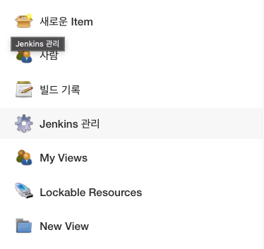

- 플러그인 관리 를 선택한다. 
  
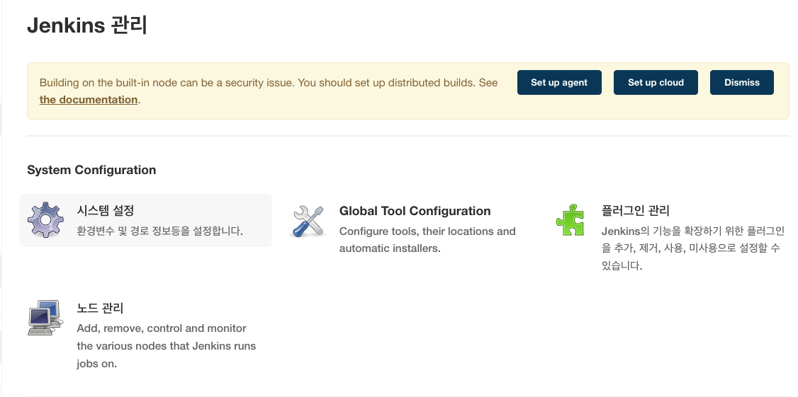

- Plugiin Manager > 설치가능 탭을 클릭한다. 
- 그리고 검색 창에 Docker를 클릭한다. 
  
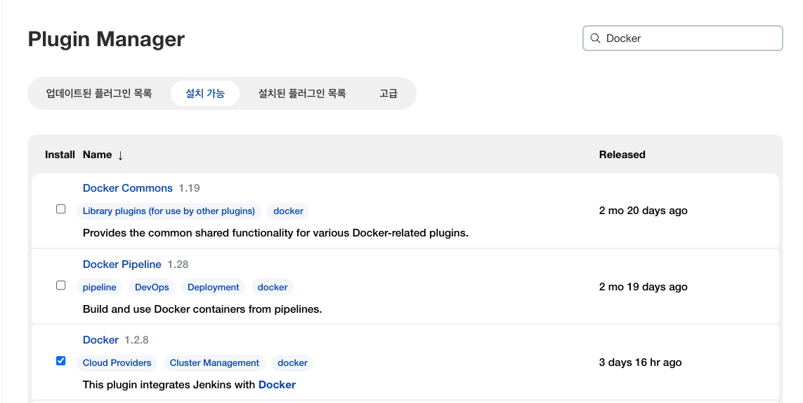

- Docker Commons, Docker Pipeline, Docker 를 선택하고, 설치한다. 
- 설치후에 Jenkins를 재시작 하도록 한다. 
  
### Global Tool 설정하기 

- Global Tool에서 Docker 를 설정할 것이다. 
- Jenkins 관리 에서 Global Tool Configuration 을 선택한다. 
  
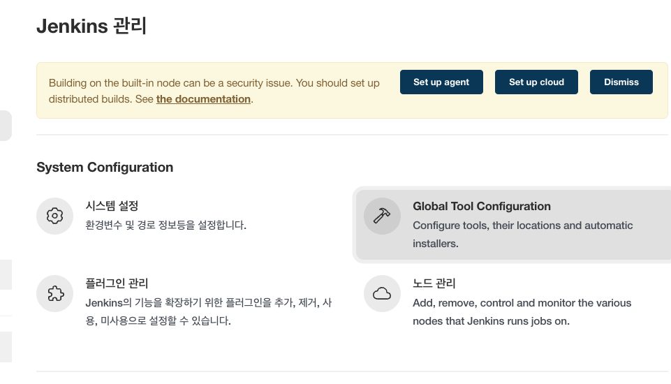

- 아래와 같이 Docker 부분을 찾고 "Add Docker" 를 클릭한다. 
- 아래 그림과 같이 입력한다. 
  
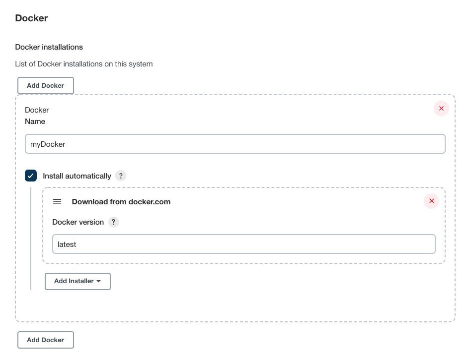

- Docker Name: myDocker
- Install automatically 를 체크한다. 
- Download from docker.com 항목을 선택한다. 
- Docker version: latest 로 선택한다. 
  
### Node 관리로 실행할 노드 지정하기. 

- 이 부분은 Jenkins Job이 실행될때 실행될 노드를 선택하는 부분이다. 
- 우리는 노드를 지정하는 Jenkinsfile 을 이용하므로 아래와 같이 노드를 선택해주자. 
- 우선 Jenkins 관리 > 노드 관리 를 선택한다. 
  
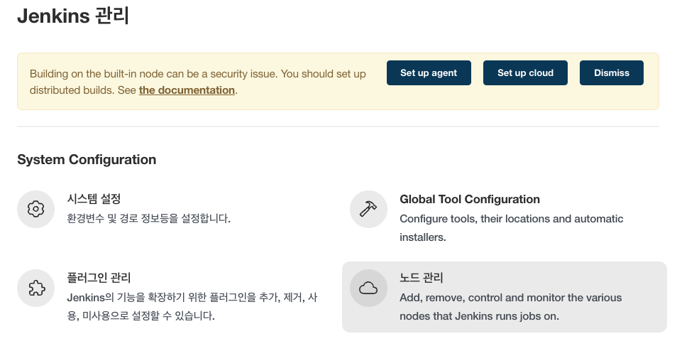

- Manage nodes and clouds 에서 노드 이름에 있는 Combobox를 누르고 > 설정을 클릭한다. 
  
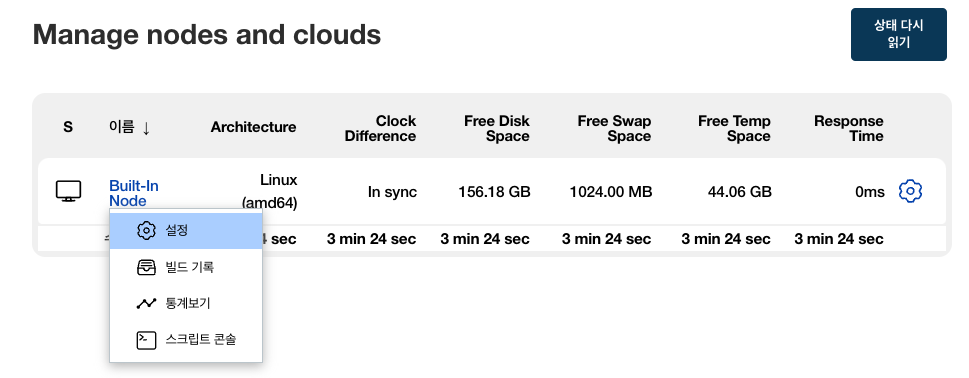

- 아래와 같이 라벨을 'linux'로 입력하고 저장한다. 
  
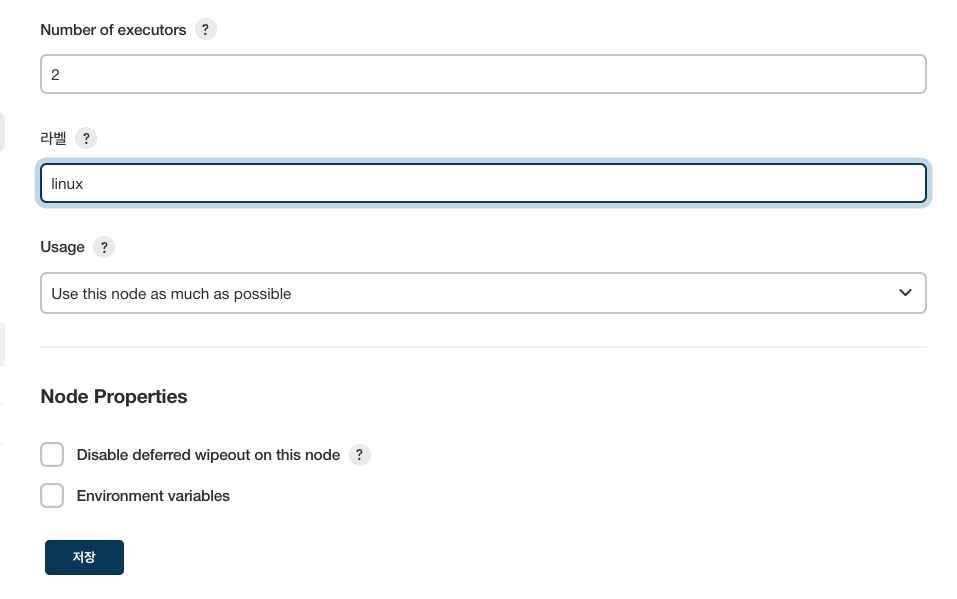

## 파이프라인 구상하기

- 우리가 수행할 파이프라인은 다음 절차대로 수행된다.
  - 1. 태스크를 수행할 대상 노드 선택하기
  - 2. 작업 디렉토리 초기화하기 
  - 3. git에서 소스 체크아웃 받기 
  - 4. tfsec 를 통해 terraform 검사하기 
  - 5. terraform 을 실행하여 프로비저닝하기 
  - 6. 작업 삭제하기 

- 위 과정에서 중요한 것은 과정을 진행하면서 오류가 발생하면, 더이상 작업을 진행하지 않도록 하는데 있다. 
- 특히 tfsec, terraform 에서 작업 오류인경우 작업을 멈춘다. 
## tfsecw.sh 파일 작성하기. 

- 이제 우리는 tfsec을 이용하여 terraform 을 정적 분석 할 것이다. 
- 이때 docker커맨드를 이용하여 현재 체크아웃 받은 디렉토리를 검사하게 된다. 

- tfsecw.sh 파일을 생성하고 다음과 같이 작성하자. 

```py
#!/bin/bash 

echo "---------------------- Check directory"

ls ./

echo "----------------------- Run tfsec with docker"

docker run --rm -v "$(pwd):/src" aquasec/tfsec /src --no-color

```

- 보는바와 같이 단순 shell파일이다. 
- docker run 을 통해서 tfsec 을 실행한다. 공식적인 tfsec 이미지는 aquasec/tfsec 이다. 
- '--rm' 컨테이너가 실행되고 바로 삭제 되도록 하였다. 
- '-v "$(pwd):/src"' 현재 실행되는 디렉토리내 파일과 컨테이너 내부의 /src 디렉토리를 연결한다. (즉, git에서 체크아웃 받은 소스 파일이 현재 파일에 놓이게 된다.)
- 'aquasec/tfsec' tfsec의 공식 이미지이다. 
- '/src' 검사할 대상 디렉토리이다. 컨테이너 내부의 디렉토리를 말한다. 
- '--no-color' jenkins에서 처리결과를 단순 텍스트로 나타내기 위해서는 --no-color 옵션을 주면된다. 이렇게 하면 jenkins 처리 결과를 깔끔하게 복사할 수 있게 된다. 

## docker가 아닌 tfsec 파일을 직접 받아서 실행하기 

```py
#!/bin/bash 

echo "---------------------- Check directory"

ls ./

echo "----------------------- Run tfsec with docker"

echo "$(pwd)"

# tfsec 을 다운로드 받는다. 
curl -fsSLO https://github.com/aquasecurity/tfsec/releases/download/v1.18.0/tfsec_1.18.0_linux_arm64.tar.gz

# tfsec_dir 에 압축을 풀기 위해서 디렉토리를 생성한다. 
mkdir "$(pwd)/tfsec_dir"

# 압축을 특정 디렉토리에 해제한다. 
tar xzvf tfsec_1.18.0_linux_arm64.tar.gz -C "$(pwd)/tfsec_dir"

# tfsec을 실행하고, 결과를 tfsec_results.xml 에 저장한다. 저장 타입은 junit 타입으로 저장하게 된다. 
$(pwd)/tfsec_dir/tfsec . -f junit > tfsec_results.xml

```

- 위와 같이 직접 tfsec 을 다운로드 받아서 실행한다. 
## terraformw 파일 작성하기 

- terraformw는 tfswitch 를 이용하여 최신 테라폼을 설치하고, 이를 이용하여 terraform 을 실행하도록 해준다. 
- 미리 jenkins에 terraform 바이너리를 설치하지 않아도 되므로 다양한 환경에서 실행이 가능한 장점이 있다. 

```py
#!/bin/bash 

echo "--------------------- Installing tfswitch locally for running terraform"

# Download terraform-switcher install file 
curl -O  https://raw.githubusercontent.com/warrensbox/terraform-switcher/release/install.sh

# 실행 가능하도록 설정 변경
chmod 755 install.sh

# tfswitch 를 설치한다. 
./install.sh -b $(pwd)/.bin

# 설치 PATH를 환경변수에 저징한다. 
CUSTOMBIN=$(pwd)/.bin

# 환경 변수 PATH에 싫애 파일을 설정한다. 
export PATH=$CUSTOMBIN:$PATH

$CUSTOMBIN/tfswitch -b $CUSTOMBIN/terraform

terraform $*
```

- curl 을 이용하여 terraform switcher 를 다운로드 받는다. 
- 다운로드 받은 쉘스크립트를 실행하고 환경변수에 등록한다. 
- '$CUSTOMBIN/tfswitch -b $CUSTOMBIN/terraform' 을 이용하여 terraform을 수행할 준비를 한다. 
- 'terraform $*' 으로 전달된 파라미터와 함께 terraform 을 실행한다. 
- terraformw 는 terraform에 전달되는 파라미터에 따라 다양한 처리를 할 수 있다. 
  - 예를 들어 terraform plan 을 수행하거나, terraform apply, terraform destroy 등을 수행할 수 있게 된다. 

## Jenkinsfile 으로 파이프라인 작성하기. 

- 이제는 Jenkinsfile 을 작성하여 파이프라인을 구성할 것이다. 
- 순서는 이전에 설명한것과 같으며 Jenkinsfile 을 생성하고, 아래와 같이 입력한다. 

```py

pipeline {
  agent { label 'linux'}
  environment {
    def dockerHome = tool 'myDocker'
    PATH = "${dockerHome}/bin:${env.PATH}"
  }
  options {
    skipDefaultCheckout(true)
  }
  stages{
    stage('clean workspace') {
      steps {
        cleanWs()
      }
    }
    stage('Initialize') {
      steps {
        echo "env ${env.PATH}"
      }
    }
    stage('checkout') {
      steps {
        checkout scm
      }
    }
    stage('tfsec') {
      failFast true
      steps {
        echo "=========== Execute tfsec ================="
        sh 'chmod 755 ./tfsecw.sh'
        sh './tfsecw.sh'
      }

      post {
        always { 
          echo "========= Check tfsec test results ========="
          junit allowEmptyResults: true, testResults: 'tfsec_results.xml', skipPublishingChecks: true
        }
        success {
          echo "Tfsec passed" 
        }
        unstable {
          error "TfSec Unstable"
        }
        failure {
          error "Tfsec failed"
        }
      }
    }
    // stage('terraform') {
    //   failFast true
    //   steps {
    //     sh 'ls .'
    //     sh 'chmod 755 ./terraformw'
    //     sh './terraformw apply -auto-approve -no-color'
    //   }
    // }
  }
  post {
    always {
      cleanWs()
    }
  }
}
```

- agent: 파이프라인이 실행될 agent 를 지정한다. 이전에 Jenkins설정에서 우리는 linux라는 이름의 노드를 설정했었다. 
- environment: 파이프라인에서 사용할 환경변수를 지정한다. 
- stages: Jenkins의 각 단계를 정의한다. 
- stage: stages 하위에 개별 단계를 정의한다. 
- steps: stage내부에 처리될 명령들을 기술한다. 

```py
    stage('checkout') {
      steps {
        checkout scm
      }
    }
```

- 위 스테이지는 github에서 체크아웃을 받는 역할을 한다. 

```py
    stage('tfsec') {
      steps {
        sh 'chmod 755 ./tfsecw.sh'
        sh './tfsecw.sh'
      }
    }
```

- 체크아웃 받은 소스에서 tfsecw.sh 파일의 실행 권한을 변경하고, sh 명령으로 쉘스크립트를 실행한다. 

```py
      post {
        always { 
          echo "========= Check tfsec test results ========="
          junit allowEmptyResults: true, testResults: 'tfsec_results.xml', skipPublishingChecks: true
        }
        success {
          echo "Tfsec passed" 
        }
        unstable {
          error "TfSec Unstable"
        }
        failure {
          error "Tfsec failed"
        }
      }
```

- 스테이지가 완료되면, junit을 거쳐 tfsec 결과파일인 tfsec_results.xml 을 검사한다. 
- unstable, failure 인경우 error을 발생시킨다. 
- 이후 작업은 'failFast true'에 따라 다음 작업을 진행하지 않게 된다. 

```py
    stage('terraform') {
      steps {
        sh 'ls .'
        sh 'chmod 755 ./terraformw'
        sh './terraformw apply -auto-approve -no-color'
      }
    }
```

- terraformw 를 실행한다. 이때 전달되는 파라미터는 apply -auto-approve -no-color이다. 
  - 'apply': terraform 으로 프로비져닝을 실제 수행한다. 
  - '-auto-approve': 프로비저닝 수행시 수행여부를 자동으로 승인처리한다. 
  - '-no-color': 처리결과를 Jenkins에서 노출할때 일반 텍스트로 노출되도록 지정한다. 결과를 다른 에디터에 단순 복사/붙여넣기에 할 수 있다. 

## Terraform sample 작성하기 

- 이제 terraform 을 작성해보자. 
- main.tf 파일을 생성하고 다음과 같이 추가한다. 

```py
resource "aws_elasticache_replication_group" "bad_example" {
         replication_group_id = "foo"
         replication_group_description = "my foo cluster"
         transit_encryption_enabled = false
}

/*
resource "aws_elasticache_replication_group" "good_example" {
         replication_group_id = "foo"
         replication_group_description = "my foo cluster"

         at_rest_encryption_enabled = true
         transit_encryption_enabled = true

 }
*/

output "jenkins_terraform" {
  value = "running Terraform from Jenkins"
}
```

- 우선 'bad_example' 을 먼저 작성하고 good_example은 주석처리해 둔다. 
- 그리고 github에 커밋하자. 

## Jenkins Job 생성하기. 

- 이제 Jenkins에서 새로운 아이템을 만들자. 

- 새로운 Item을 클릭한다.
  
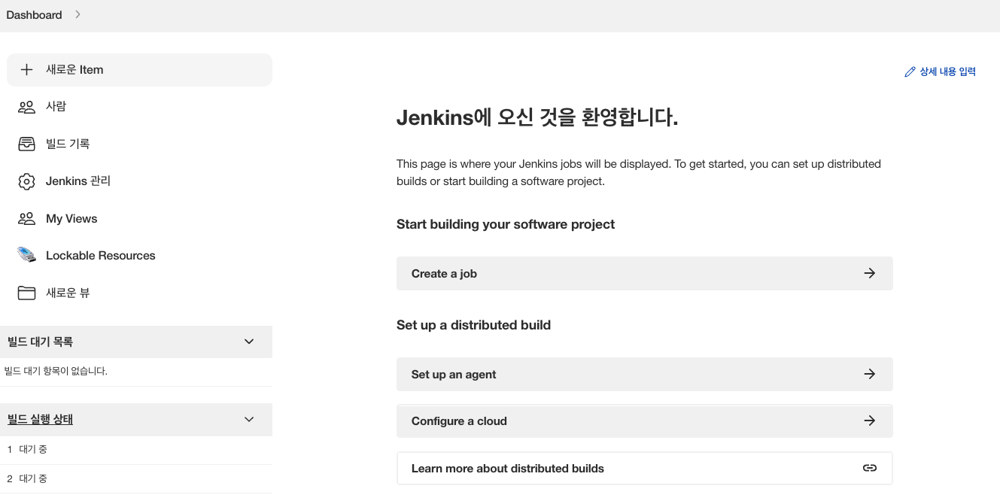

- 아이템 이름은 tfsec_test로 하자. 
- 유형은 Pipeline 을 선택하고 "OK"를 클릭한다. 
  
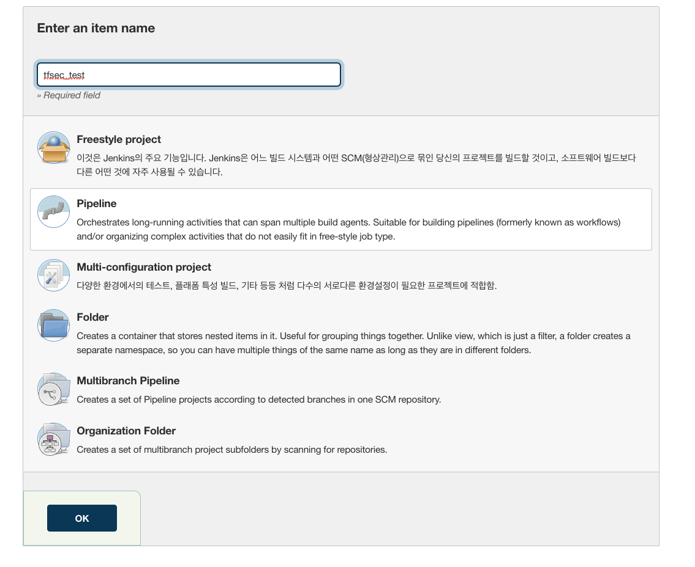

- 설명을 대충 작성하고, 저장되는 빌드 개수는 "오래된 빌드 삭제" 에서 5개만 유지하게 하자. 
  
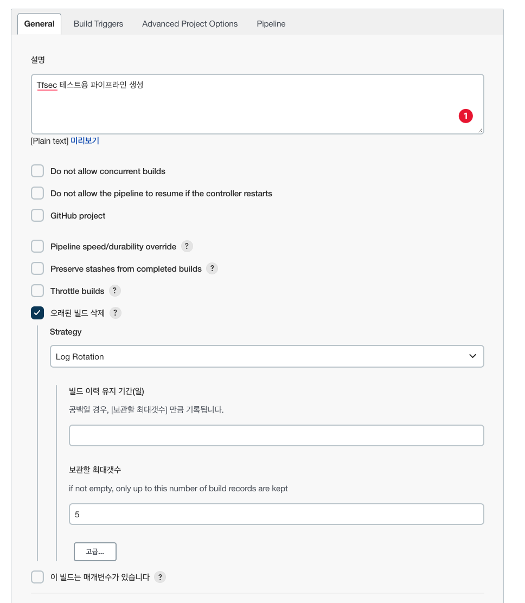

- 파이프라인에서 다음과 같이 선택한다. 
- Definition: Pipeline script from SCM 을 선택한다. 
- SCM: Git 을 선택한다. (만약 다른 SVC툴을 이용한다면 플러그인을 별도로 설치해 주어야한다.)
- Repository URL: https://github.com/schooldevops/tfsec-terraform-sample.git 으로 우리가 작성한 소스코드 경로를 넣어준다. 
- 나머지 부분은 그대로 둔다. 
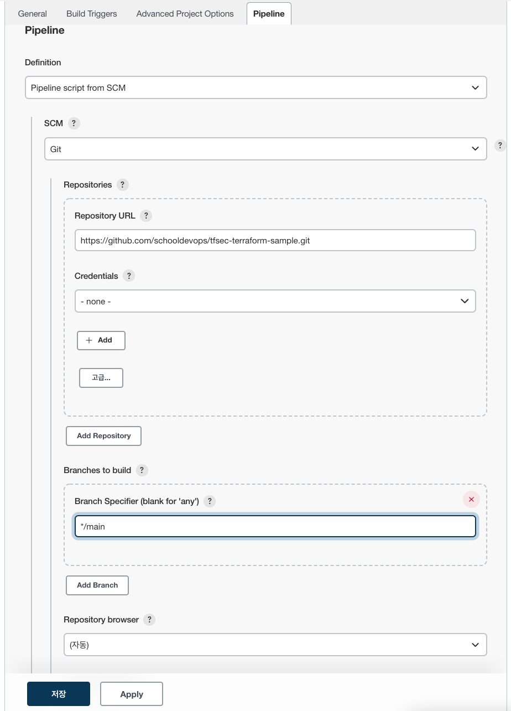
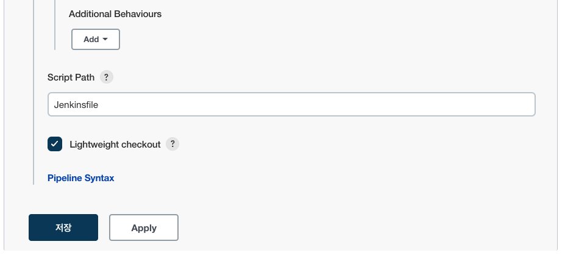

- 모두 작성이 되었다면 "지금 빌드" 를 실행해보자. 

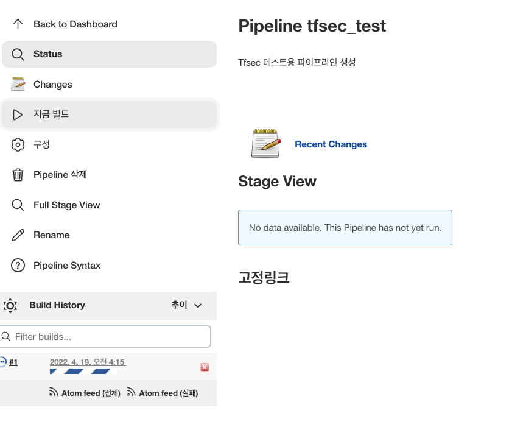

## 실행결과 (정상 케이스)

- 우리가 테스트할 main.tf 코드는 정상케이스인 경우이다. 

```py
resource "aws_elasticache_replication_group" "bad_example" {
         replication_group_id = "foo"
         replication_group_description = "my foo cluster"
         transit_encryption_enabled = true
         at_rest_encryption_enabled = true
 }

output "jenkins_terraform" {
  value = "running Terraform from Jenkins"
}
```

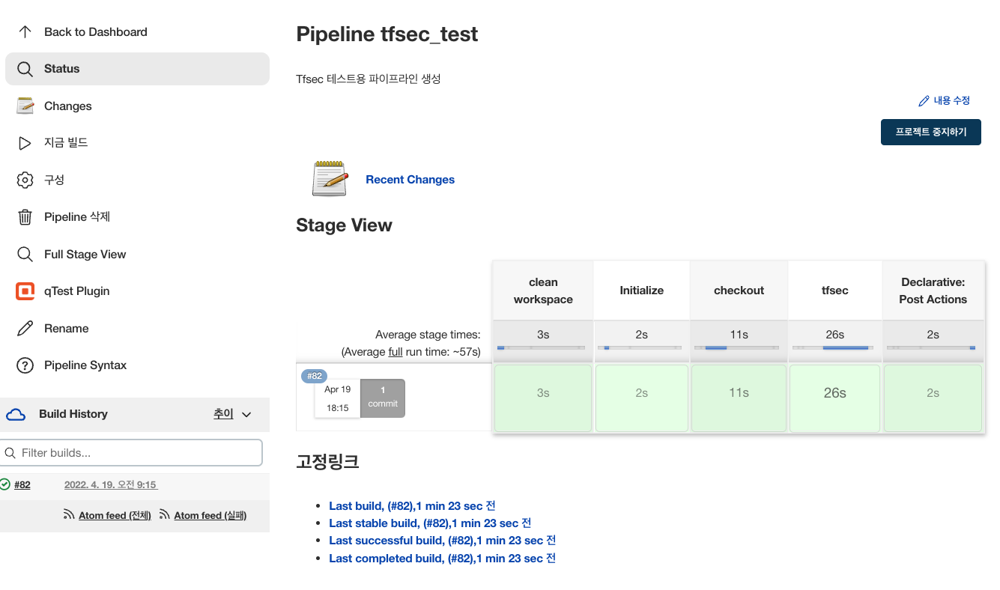

- 정상적으로 파이프라인이 실행 되었다. 

## 실행결과 (비정상 케이스)

- 이제는 main.tf에 문제가 있는 경우이다. 
- transit_encryption_enabled = false, at_rest_encryption_enabled = false 으로 변경하였다. 

```py
resource "aws_elasticache_replication_group" "bad_example" {
         replication_group_id = "foo"
         replication_group_description = "my foo cluster"
         transit_encryption_enabled = false
         at_rest_encryption_enabled = false
 }

output "jenkins_terraform" {
  value = "running Terraform from Jenkins"
}
```

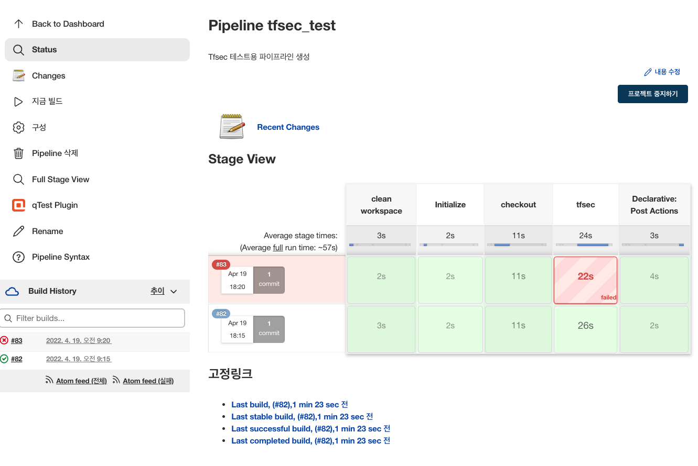

- 오류가 발생했음을 확인할 수 있다. 

### tfsec 처리 결과 파일 확인하기

- tfsec_results.xml 파일은 다음과 같이 문제가 생겼음을 확인할 수 있다. 

```xml
<?xml version="1.0" encoding="UTF-8"?>
<testsuite name="tfsec" failures="2" tests="2">
	<testcase classname="main.tf" name="[aws-elasticache-enable-at-rest-encryption][HIGH] - Replication group does not have at-rest encryption enabled." time="0">
		<failure message="Replication group does not have at-rest encryption enabled." type="">main.tf:5&#xA;&#xA;https://aquasecurity.github.io/tfsec/v1.18.0/checks/aws/elasticache/enable-at-rest-encryption/</failure>
	</testcase>
	<testcase classname="main.tf" name="[aws-elasticache-enable-in-transit-encryption][HIGH] - Replication group does not have transit encryption enabled." time="0">
		<failure message="Replication group does not have transit encryption enabled." type="">main.tf:4&#xA;&#xA;https://aquasecurity.github.io/tfsec/v1.18.0/checks/aws/elasticache/enable-in-transit-encryption/</failure>
	</testcase>
</testsuite>
```

- 오류 파일에 오류 상세 정보를 확인할 수 있다. 

### Jenkins 처리결과 확인하기. 

```py
... 생략
Post stage
[Pipeline] echo
========= Check tfsec test results =========
[Pipeline] junit
Recording test results
[Pipeline] error
Error when executing unstable post condition:
hudson.AbortException: TfSec Unstable
	at org.jenkinsci.plugins.workflow.steps.ErrorStep$Execution.run(ErrorStep.java:64)
	at org.jenkinsci.plugins.workflow.steps.ErrorStep$Execution.run(ErrorStep.java:51)

... 생략 

```

- TfSec Unstable 으로 파이프라인 작업이 Abort 된것을 확인할 수 있다. 
- 이후 Terraform 주식을 풀고 다음으로 진행할 수 있을 것이다. 

## WrapUp

- 지금까지 Jenkins를 설치하고, Tfsec + Terraform 을 진행하는 파이프라인을 생성했다. 
- Terraform 을 배포하기 전에 Tfsec을 우선 처리하고, 문제가 발생하는 경우 fail_fast 로 다음 스텝을 스킵할 수 있다. 
- 위 Jenkins Pipeline 을 변형하여 Git에 Terraform 파일이 Commit 이 되면 정적 분석을 수행하여 알림을 줄 수 도 있을 것이다. 